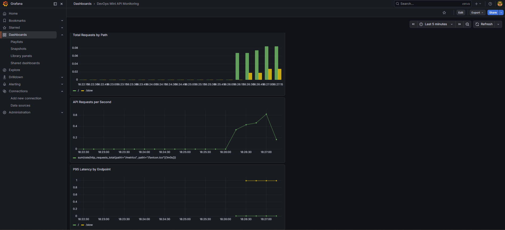

# 🚀 DevOps Mini API Monitoring

A small demo project for monitoring a FastAPI service using **Prometheus + Grafana + Docker Compose**.

---

## 🧠 Features

* FastAPI application
* Prometheus metrics (`/metrics`)
* Request counter & latency (Histogram)
* Grafana dashboards
* Fully dockerized setup

---

## ⚙️ Tech Stack

* Python (FastAPI)
* Prometheus
* Grafana
* Docker / Docker Compose

---

## 📁 Project Structure

```
.
├── app/
│   ├── main.py
│   └── requirements.txt
├── infra/
│   └── prometheus/
│       └── prometheus.yml
├── docker-compose.yml
├── Dockerfile
└── README.md
```

---

## 🚀 Run project

```bash
docker compose up --build
```

---

## 🌐 Endpoints

* API: http://localhost:8000
* Swagger: http://localhost:8000/docs
* Metrics: http://localhost:8000/metrics
* Grafana: http://localhost:3000

---

## 📊 Grafana Dashboards

* API Requests per Second
* Total Requests by Path
* P95 Latency by Endpoint

---

## 🧪 Example requests

```bash
curl http://localhost:8000/
curl http://localhost:8000/slow
```

---

## 📸 Demo



---

## 📈 Example Prometheus Queries

### Requests per second

```promql
sum(rate(http_requests_total{path!="/metrics", path!="/favicon.ico"}[$__rate_interval]))
```

### Total requests by path

```promql
sum by (path) (http_requests_total{path!="/metrics", path!="/favicon.ico"})
```

### P95 latency

```promql
histogram_quantile(
  0.95,
  sum(rate(http_request_duration_seconds_bucket{path!="/metrics", path!="/favicon.ico"}[$__rate_interval])) by (le, path)
)
```

---

## 💡 What I learned

* How to instrument FastAPI with Prometheus
* How Prometheus collects and stores metrics
* How to build Grafana dashboards
* How to monitor latency (P95)
* How to run a monitoring stack using Docker

---

## 🎯 Why this project matters

This project demonstrates:

* basic observability principles
* metrics collection & visualization
* working with Prometheus and Grafana
* containerized environment setup
* real-world DevOps monitoring workflow

---

## 👩‍💻 Author

**Anastasiia Savenok**
